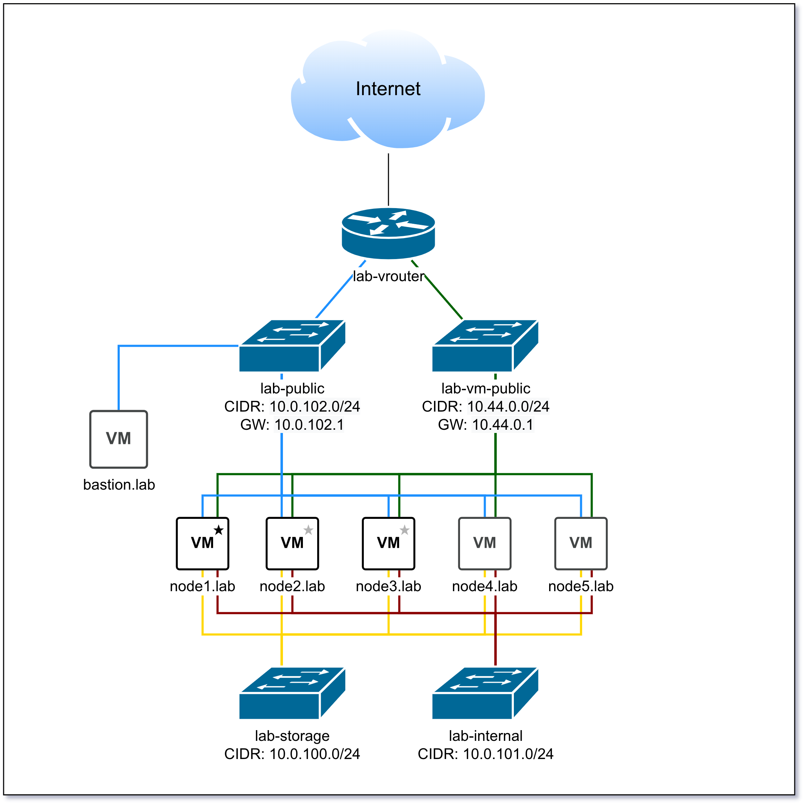
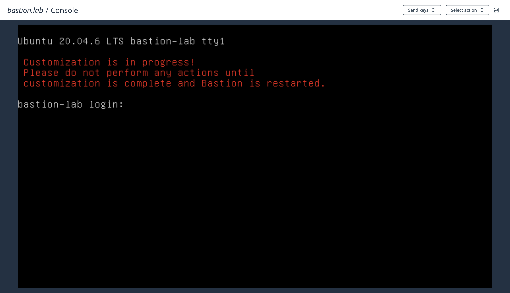
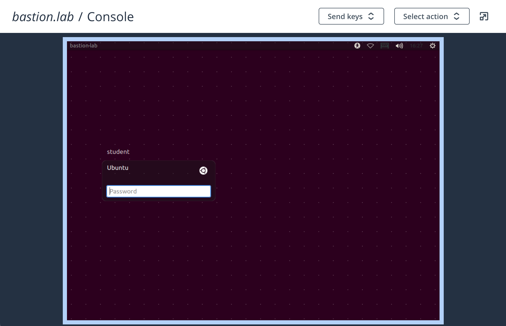
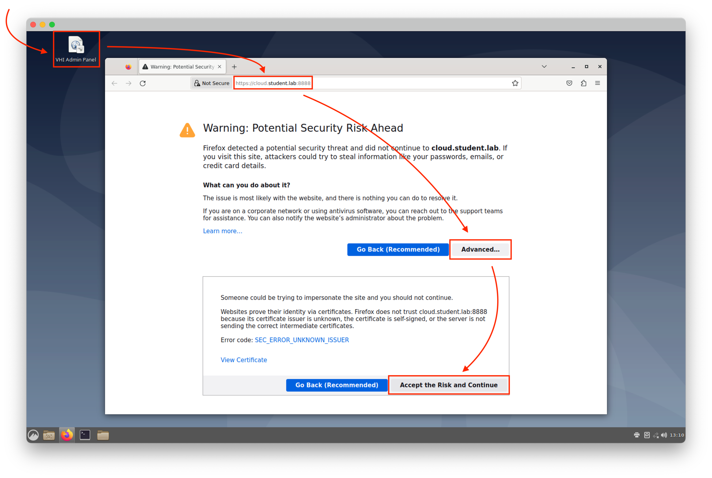
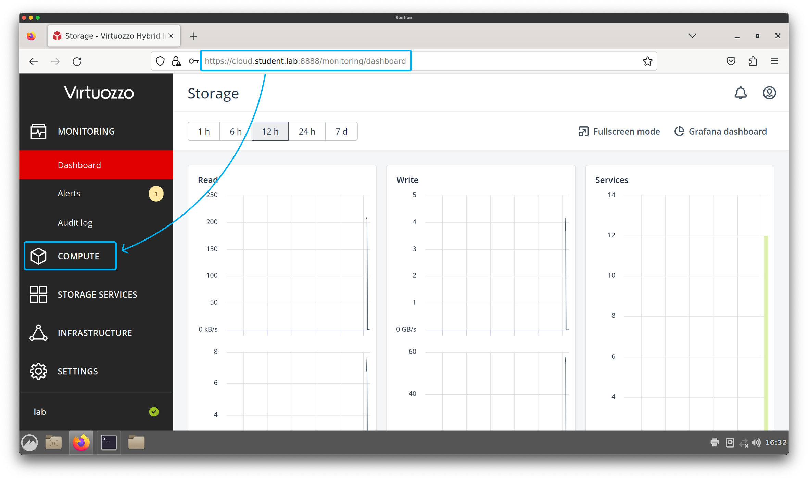

<!-- TOC -->
  * [Description](#description)
  * [Structure and conventions](#structure-and-conventions)
  * [Pre-requisites](#pre-requisites)
    * [Nested virtualization support](#nested-virtualization-support)
    * [Project resource quotas](#project-resource-quotas)
    * [Images](#images)
  * [Sandbox provisioning](#sandbox-provisioning)
    * [Step 1: Clone the repository](#step-1-clone-the-repository)
    * [Step 2: Install Terraform](#step-2-install-terraform)
    * [Step 3: Adjust Terraform Variables](#step-3-adjust-terraform-variables)
      * [Adjust VHI nodes variables](#adjust-vhi-nodes-variables)
        * [VHI Image name](#vhi-image-name)
        * [Main node flavor](#main-node-flavor)
        * [Worker node flavor](#worker-node-flavor)
      * [Adjust Bastion VM variables](#adjust-bastion-vm-variables-)
        * [Bastion image name](#bastion-image-name)
        * [Bastion flavor](#bastion-flavor)
      * [Adjust SSH key path](#adjust-ssh-key-path)
    * [Step 4: Adjust and source OpenStack credentials file](#step-4-adjust-and-source-openstack-credentials-file)
    * [Step 5: Provision the sandbox](#step-5-provision-the-sandbox)
  * [Verifying results](#verifying-results)
    * [Verify Bastion VM completed provisioning](#verify-bastion-vm-completed-provisioning)
    * [Verify nested VHI cluster is fully configured.](#verify-nested-vhi-cluster-is-fully-configured)
<!-- TOC -->

## Description

This repository contains code to automatically provision and configure a sandbox environment 
for students working on VHI Operations Professional training course. 

This repository is intended for Virtuozzo Technical Trainers to provision a sandbox for students on top of
Virtuozzo Hybrid Infrastructure cloud. However, it can benefit anyone with access to an OpenStack
or Virtuozzo Hybrid Infrastructure project who wishes to complete VHI Operations Professional course.

The resulting sandbox will consist of 5 VMs and pre-configured virtual network infrastructure.
Here is the diagram of the infrastructure of a sandbox students will work with:



> The Terraform plan is **not** going to provision `node5.lab` VM.
> 
> Deploying this VM is one of the exercises student will take during the course.

## Structure and conventions

The repository contains:
- Terraform plan files, ending with .tf extension.
- Shell scripts ending with .sh extension.
- Auxiliary files required for students to complete the course (.zip)

Terraform plan files follow this naming scheme:
- 00_vars_*.tf contain variables.
- 10_data_*.tf contain runtime data collection modules.
- 20_res_*.tf contain resource definitions.

## Pre-requisites

To use this automation, your environment must meet the requirements described below.

### Nested virtualization support
- The OpenStack or VHI cloud must support nested virtualization.

>**How to test if nested virtualization is enabled.**
>
>On Intel CPUs, you can test if cloud supports nested virtualization by deploying a test VM
and executing the following command:
>
>```# cat /proc/cpuinfo | grep vmx```

### Project resource quotas

The cloud project must provide following resources:

- RAM: 130 GiB.
- vCPU: 66 cores.
- Disk space: 3260 GiB.
- Public IPs: 2.

### Images

The project you are working with must have the following images:

**VHI QCOW2 image.** 
- The image must not be of latest version to enable student to complete the updates exercise.
- The image must have `cloud-init` installed.

> If you are not a Virtuozzo employee, request the appropriate image from your Onboarding Manager.

**Ubuntu 20.04 QCOW2 image.**
- The image must have `cloud-init` installed.

> You can get the latest version of the image on Ubuntu website:
> 
> https://cloud-images.ubuntu.com/releases/focal/release/ubuntu-20.04-server-cloudimg-amd64.img


## Sandbox provisioning

To provision a sandbox, you will need to complete 5 steps:
1. Clone this repository to your workstation.
2. Install Terraform on your workstation.
3. Adjust Terraform variables.
4. Adjust and source OpenStack credentials file.
5. Apply Terraform configuration.

### Step 1: Clone the repository

``` 
$ git clone https://github.com/virtuozzo/vhi-ops-professional
```
```
$ cd vhi-ops-professional
```

### Step 2: Install Terraform

Download and install Terraform for your operating system from 
[Terraform website](https://developer.hashicorp.com/terraform/downloads).

### Step 3: Adjust Terraform Variables

You will need to adjust 3 variable files: 
- `00_vars_vhi_cluster.tf` to set variables related to VHI nodes.
- `00_vars_bastion.tf` to set variables related to Bastion VM.
- `00_vars_access.tf` to set SSH key path for sandbox.

#### Adjust VHI nodes variables

You need to adjust 3 variables in `00_vars_vhi_cluster.tf` file:
1. VHI image name.
2. Main node flavor.
3. Worker node flavor.

##### VHI Image name

You need to set `vhi_image` variable to name of the VHI image in your project.
For example, if in your cloud VHI image is named `vhi-5.4.3`, the variable should look like this:

```
variable "vhi_image" {
  type = string
  default = "VHI-5.4.3" # If required, replace image name with the one you have in the cloud
}
```

##### Main node flavor

You need to set `flavor_main` variable to the flavor name that provides at least 16 CPU cores and 32 GiB RAM.
For example, if in your cloud such flavor is named `va-16-32`, the variable should look like this:

```
### Main node flavor name
variable "flavor_main" {
  type    = string
  default = "va-16-32"  # If required, replace flavor name with the one you have in the cloud
}
```

##### Worker node flavor

You need to set `flavor_worker` variable to the flavor name that provides at least 8 CPU cores and 16 GiB RAM.
For example, if in your cloud such flavor is named `va-8-16`, the variable should look like this:

```
### Worker node flavor name
variable "flavor_worker" {
  type    = string
  default = "va-8-16"   # If required, replace flavor name with the one you have in the cloud
}
```

#### Adjust Bastion VM variables 

You need to adjust 2 variables in `00_vars_bastion.tf` file:
1. Bastion image name.
2. Bastion flavor.

##### Bastion image name

You need to set `vhi_image` variable to name of the Bastion image in your project.
For example, if in your cloud Bastion image is named `Ubuntu 20.04`, the variable should look like this:

```
## Bastion image
variable "bastion_image" {
  type = string
  default = "Ubuntu 20.04" # If required, replace image name with the one you have in the cloud
}
```

##### Bastion flavor

You need to set `flavor_worker` variable to the flavor name that provides at least 1 CPU core and 2 GiB RAM.
For example, if in your cloud such flavor is named `va-1-2`, the variable should look like this:

```
## Bastion flavor
variable "flavor_bastion" {
  type = string
  default = "va-1-2"      # If required, replace flavor name with the one you have in the cloud
}
```

#### Adjust SSH key path

You need to set `ssh-key` variable in `00_vars_access.tf` file to point to the SSH key.
For example, if your SSH key is located in `~/.ssh/student.pub`, the variable should look like this:

```
variable "ssh-key" {
  type    = string
  default = "~/.ssh/student.pub"
}
```

### Step 4: Adjust and source OpenStack credentials file

This repository contains `openstack-creds.sh` file you can adjust to get a usable OpenStack credentials file.
You will need to change some environmental variables in it related to your OpenStack credentials.

Follow the instructions in the file to get a usable OpenStack credentials file:
```
export OS_PROJECT_DOMAIN_NAME=vhi-ops           # replace "vhi-ops" with your domain name
export OS_USER_DOMAIN_NAME=vhi-ops              # replace "vhi-ops" with your domain name
export OS_PROJECT_NAME=student1                 # replace "student1" with your project name again
export OS_USERNAME=user.name                    # replace "user.name" with your user name
export OS_PASSWORD=**********                   # replace "**********" with password of your user
export OS_AUTH_URL=https://mycloud.com:5000/v3  # replace "mycloud.com" with the domain name of your self-service panel
export OS_IDENTITY_API_VERSION=3
export OS_AUTH_TYPE=password
export OS_INSECURE=true
export PYTHONWARNINGS="ignore:Unverified HTTPS request is being made"
export NOVACLIENT_INSECURE=true
export NEUTRONCLIENT_INSECURE=true
export CINDERCLIENT_INSECURE=true
export OS_PLACEMENT_API_VERSION=1.22
```

After you adjust the `openstack-creds.sh` file, source it in your terminal:

```
$ source openstack-creds.sh
```

### Step 5: Provision the sandbox

Initialize Terraform in the directory and apply Terraform plan that will set up the sandbox:

```
$ terraform init && terraform apply
```

> Wait at least 20 minutes before proceeding!
> Terraform will configure all VMs at first boot, which can take some time depending on the cloud performance and internet connection speed.

## Verifying results

After applying Terraform plan and waiting for scripts to complete the configuration of the environment, you may proceed to verify the access.

> If you are not a Virtuozzo employee, request Bastion VM credentials from your Onboarding Manager.

### Verify Bastion VM completed provisioning

Connect to Bastion VM using remote console.
If Bastion VM is still being configured, you will see the following prompt:



Once the configuration of Bastion is complete, you should see the graphical login prompt:



### Verify nested VHI cluster is fully configured.

Students are expected to work with their sandbox using RDP connection to Bastion VM.
To verify that nested VHI cluster is ready for students to begin training, do the following:

1. Connect to the Bastion VM using RDP client on port `3390`.
2. Access nested VHI Admin Panel using desktop shortcut (username `admin`; password: `Lab_admin`):



3. Navigate to Compute section in the left-hand menu:



You should see compute cluster deployment progress bar:


Once compute cluster is deployed the sandbox is ready for use.
