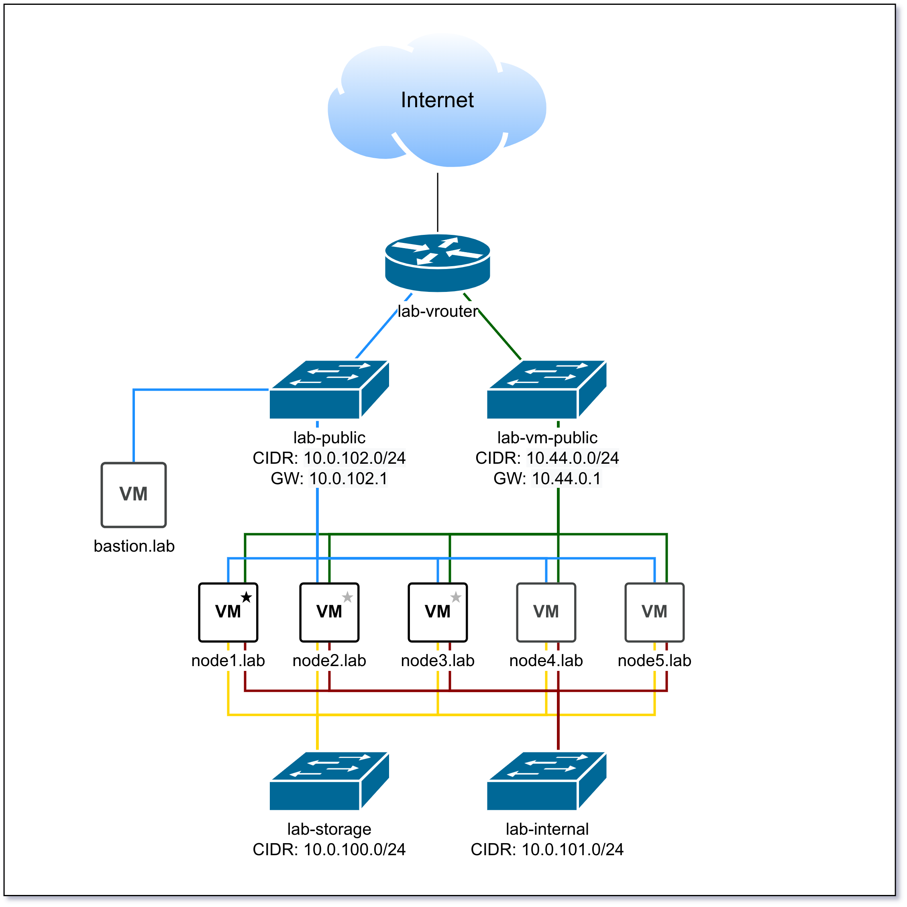
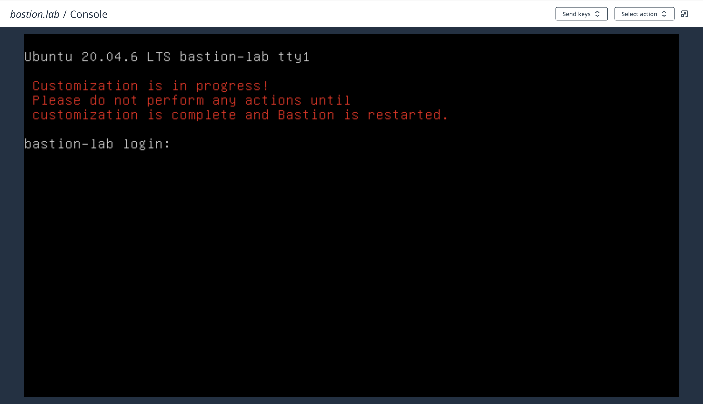
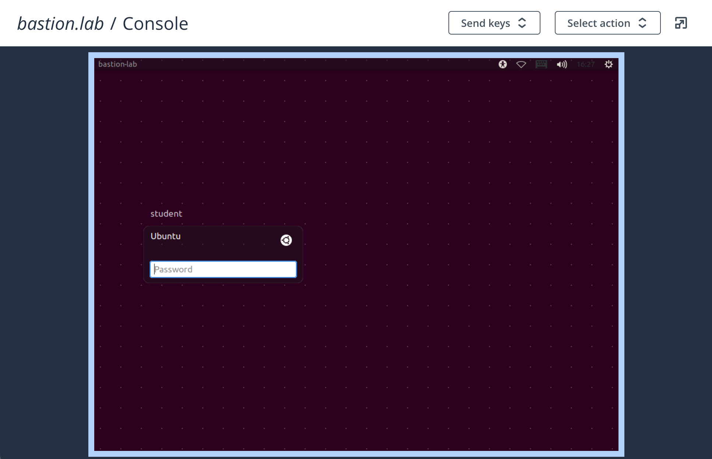
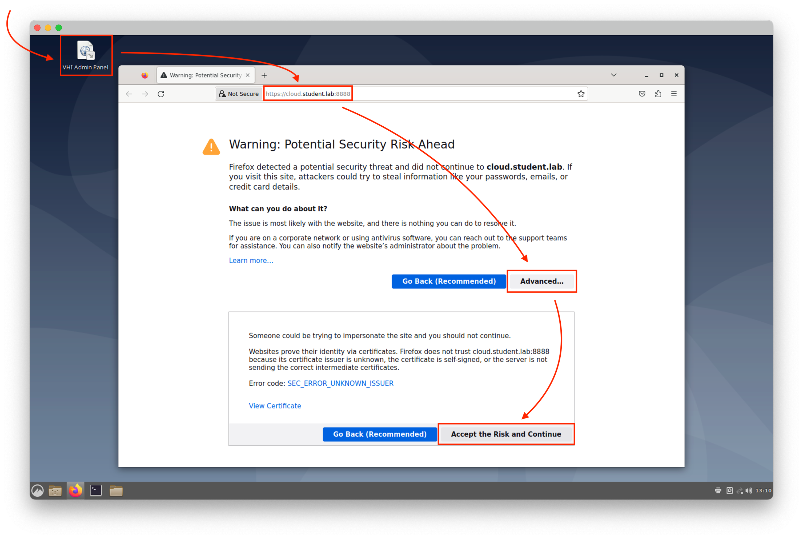
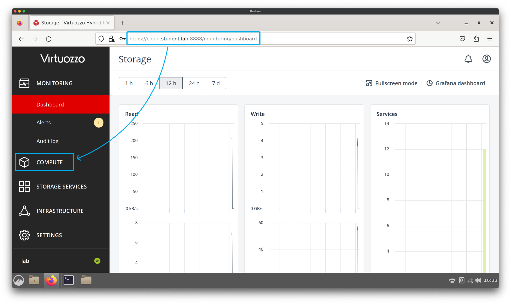

<!-- TOC -->
  * [Description](#description)
    * [Pre-configured domain and users (S3 track)](#pre-configured-domain-and-users-s3-track)
  * [Structure and conventions](#structure-and-conventions)
  * [Pre-requisites](#pre-requisites)
    * [Nested virtualization support](#nested-virtualization-support)
    * [Project resource quotas](#project-resource-quotas)
    * [Images](#images)
  * [Sandbox provisioning](#sandbox-provisioning)
    * [Step 1: Clone the repository](#step-1-clone-the-repository)
    * [Step 2: Install Terraform](#step-2-install-terraform)
    * [Step 3: Adjust Terraform Variables](#step-3-adjust-terraform-variables)
      * [Adjust SSH key path](#adjust-ssh-key-path)
      * [Adjust Bastion VM variables](#adjust-bastion-vm-variables)
        * [Bastion image name](#bastion-image-name)
        * [Bastion flavor](#bastion-flavor)
        * [Bastion storage policy](#bastion-storage-policy)
      * [Adjust Virtuozzo Infrastructure node variables](#adjust-virtuozzo-infrastructure-node-variables)
        * [Virtuozzo Infrastructure Image name](#virtuozzo-infrastructure-image-name)
        * [Main node flavor](#main-node-flavor)
        * [Worker node flavor](#worker-node-flavor)
        * [Virtuozzo Infrastructure node storage policy](#virtuozzo-infrastructure-node-storage-policy)
      * [Adjust networking variables](#adjust-networking-variables)
    * [Step 4: Adjust and source the OpenStack credentials file](#step-4-adjust-and-source-the-openstack-credentials-file)
    * [Step 5: Provision the sandbox](#step-5-provision-the-sandbox)
  * [Retrieving Bastion VM credentials](#retrieving-bastion-vm-credentials)
  * [Verifying results](#verifying-results)
    * [Verify Bastion VM completed provisioning](#verify-bastion-vm-completed-provisioning)
    * [Verify that the nested Virtuozzo Infrastructure cluster is fully configured.](#verify-that-the-nested-virtuozzo-infrastructure-cluster-is-fully-configured)
<!-- TOC -->

## Description

This repository provisions a nested Virtuozzo Infrastructure (VHI) sandbox for the **Virtuozzo Infrastructure Operations Professional** courses. **One codebase** supports two curricula via Terraform variable **`lab_track`** in [`00_vars_lab_track.tf`](00_vars_lab_track.tf):

| `lab_track` | Curriculum |
|-------------|------------|
| **`operations`** (default) | Standard operations track: **VM_Public** lab network and a **fourth NIC** on cluster nodes; cloud-init [`cloud-init/node.operations.sh`](cloud-init/node.operations.sh) and [`cloud-init/bastion.operations.sh`](cloud-init/bastion.operations.sh). **`node5.lab` is not created by Terraform**—deploying it is a student exercise. |
| **`s3`** | Object storage (S3) track: **three NICs**, no VM_Public network; **three main nodes only** (no separate worker VMs—`vhi-worker_count` is ignored). [`cloud-init/node.s3.sh`](cloud-init/node.s3.sh) and [`cloud-init/bastion.s3.sh`](cloud-init/bastion.s3.sh). **No `node5.lab` exercise.** If `vhi-cluster_name` is left empty ([`00_vars_vhi_cluster.tf`](00_vars_vhi_cluster.tf)), the storage cluster defaults to **`vhi-s3-ops-lab`**. |

**Do not change `lab_track` on an existing workspace** without destroying and recreating the environment: network layout and instance `user_data` differ by track.

The **operations** track is **five VMs** (bastion plus `node1.lab`–`node4.lab`). The **S3** track is **four VMs** (bastion plus **`node1.lab`–`node3.lab`** only). Virtual networks match each track. Reference diagram:



_If the diagram shows more cluster nodes, treat extras as **operations**-track context (`node4` / optional `node5.lab` exercise); **S3** uses three main nodes only._

### Pre-configured domain and users (S3 track)

When **`lab_track = "s3"`**, during first-boot on **`node1.lab` only**, [`cloud-init/node.s3.sh`](cloud-init/node.s3.sh) creates:

| Item | Detail |
|------|--------|
| Domain | **WonderSI** |
| Project | **MyProject** (under WonderSI) |
| User | **domainadmin** (domain_admin + project_admin on MyProject) |
| Password | Same value as Terraform **`vhi-password_admin`** (default **`Lab_admin`** unless you override it). |
| Cluster DNS | Forwarders **8.8.8.8** and **1.1.1.1** via `vinfra cluster settings dns set`. |

**Admin Panel** login (see [Verifying results](#verifying-results)) uses **`admin`** / **`Lab_admin`** by default—the same default as **`vhi-password_admin`** when variables are unchanged. **`domainadmin`** is for WonderSI / MyProject work in S3 labs.

## Structure and conventions

The repository contains:
- Terraform plan files, ending with `.tf` extension.
- Track-specific cloud-init scripts under [`cloud-init/`](cloud-init/) (`node.operations.sh` / `node.s3.sh`, `bastion.operations.sh` / `bastion.s3.sh`), selected automatically from **`lab_track`** (you do not edit these unless you are changing the lab behavior).
- `openstack-creds.sh` for sourcing cloud credentials.
- Auxiliary files for students, including `WonderSI_Logos.zip` (branding aligned with the **WonderSI** domain on the S3 track).

Terraform plan files follow this naming scheme:
- `00_vars_*.tf` files contain variables (including **`lab_track`** in [`00_vars_lab_track.tf`](00_vars_lab_track.tf)).
- `10_data_*.tf` files contain runtime data collection modules.
- `20_res_*.tf` files contain resource definitions.

## Pre-requisites

To use this automation, your environment must meet the requirements described below.

### Nested virtualization support
- The OpenStack or Virtuozzo Infrastructure cloud must support nested virtualization.

**How to test if nested virtualization is enabled.**

Deploy a test VM and run the following on the guest (Intel exposes `vmx`, AMD exposes `svm`):

```bash
grep -E 'vmx|svm' /proc/cpuinfo
```

If this prints matching lines, the VM likely exposes hardware virtualization flags to the guest (nested virtualization may be available; the hypervisor and cloud policy still apply).

### Project resource quotas

Requirements depend on **`lab_track`**. In both cases you need **1 floating IP** for the bastion and **1 public IP** for the lab router (SNAT / external connectivity). Your cloud may show router and bastion separately in quota or UI.

#### Operations track (`lab_track = "operations"`, default)

Recommended minimums **including** the extra worker students add as **`node5.lab`** (8 vCPU, 16 GiB RAM, 150 + 2×100 GiB volumes):

- vCPU: 68 cores.
- RAM: 132 GiB.
- Disk space: ~1760 GiB.

These are **not** only what the first `terraform apply` consumes; they reserve headroom for the lab exercise.

#### S3 track (`lab_track = "s3"`)

Aligned with default flavors after a single **`terraform apply`**: bastion (2 vCPU / 4 GiB) plus **three** main nodes (16 vCPU / 32 GiB each)—**no worker VMs**.

- vCPU: 50 cores.
- RAM: 100 GiB.
- Disk space: ~1060 GiB (bastion 10 GiB + three nodes × (150 + 2×100) GiB volumes).

### Images

The project you are working with must have the following images:

- Virtuozzo Infrastructure ISO image
  - https://repo.virtuozzo.com/vz-platform/releases/7.0/x86_64/iso/vz-platform-7.0.iso
- Virtuozzo Infrastructure QCOW2 image
  - https://downloads.virtuozzo.com/vzlinux-iso-hci-7.0.0-251.qcow2
- Ubuntu 20.04 QCOW2 image
  - https://cloud-images.ubuntu.com/releases/focal/release/ubuntu-20.04-server-cloudimg-amd64.img

Please do not use other versions of Virtuozzo Infrastructure or Ubuntu images, as the deployment script will likely fail to configure them.

## Sandbox provisioning

To provision a sandbox, you will need to complete five steps:
1. Clone this repository to your workstation.
2. Install Terraform on your workstation.
3. Adjust Terraform variables.
4. Adjust and source the OpenStack credentials file.
5. Apply Terraform configuration.

### Step 1: Clone the repository

``` 
git clone https://github.com/virtuozzo/vhi-ops-professional
```
```
cd vhi-ops-professional
```

### Step 2: Install Terraform

Download and install Terraform for your operating system from 
[Terraform website](https://developer.hashicorp.com/terraform/downloads).

Use **Terraform 0.14.0 or newer** (see `required_version` in the root module). This configuration pins the **OpenStack** provider to **~> 1.48** and **random** to **~> 3.5**; run `terraform init` in the repository root so the correct provider versions are installed.

### Step 3: Adjust Terraform Variables

You will need to review and usually adjust these variable files:

- [`00_vars_lab_track.tf`](00_vars_lab_track.tf) — set **`lab_track`** to **`operations`** (default) or **`s3`**. You can instead pass **`-var='lab_track=s3'`** at apply time or use a `*.auto.tfvars` file (see Step 5).
- `00_vars_access.tf` — SSH public key path for the sandbox.
- `00_vars_bastion.tf` — Bastion VM image, flavor, storage policy.
- `00_vars_network.tf` — networking (VM_Public variables apply only when **`lab_track = "operations"`**).
- `00_vars_vhi_cluster.tf` — cluster images, flavors, storage policy, passwords. Leave **`vhi-cluster_name`** empty to use the track default (`vhi-ops-pro-lab` or `vhi-s3-ops-lab`); set it explicitly to override.

#### Adjust SSH key path

You need to set the `ssh_key` variable in the `00_vars_access.tf` file to point to the SSH key.
For example, if your SSH key is located in `~/.ssh/student.pub`, the variable should look like this:

```
## Bastion/Node access SSH key
variable "ssh_key" {
  type    = string
  default = "~/.ssh/student.pub" # Replace with the path to your public SSH key
}
```

#### Adjust Bastion VM variables 

You need to adjust three variables in `00_vars_bastion.tf` file:
1. Bastion image name.
2. Bastion flavor.
3. Bastion storage policy


##### Bastion image name

You need to set the `bastion-image` variable to the name of the Bastion image in your project.
For example, if in your cloud Bastion image is named `Ubuntu-20.04`, the variable should look like this:

```
## Bastion image
variable "bastion-image" {
  type = string
  default = "Ubuntu-20.04" # If required, replace the image name with the one you have in the cloud
}
```

##### Bastion flavor

You need to set the `bastion-flavor` variable to the flavor name that provides at least 2 CPU cores and 4 GiB RAM.
For example, if in your cloud such flavor is named `va-2-4`, the variable should look like this:

```
## Bastion flavor
variable "bastion-flavor" {
  type = string
  default = "va-2-4"      # If required, replace the flavor name with the one you have in the cloud
}
```

##### Bastion storage policy

You need to set the `bastion-storage_policy` variable to the storage policy with at least 10GB of storage in the project's quota.
For example, if in your cloud such policy is named `default`, the variable should look like this:

```
## Bastion storage policy
variable "bastion-storage_policy" {
  type    = string
  default = "default"     # If required, replace the storage policy with the one you have in the cloud
}
```

#### Adjust Virtuozzo Infrastructure node variables

You need to adjust four variables in the `00_vars_vhi_cluster.tf` file:
1. Virtuozzo Infrastructure image name.
2. Main node flavor.
3. Worker node flavor.
4. Virtuozzo Infrastructure node storage policy

##### Virtuozzo Infrastructure Image name

You need to set the `vhi-image` variable to the name (or UUID—see below) of the Virtuozzo Infrastructure image in your project.
For example, if in your cloud, the Virtuozzo Infrastructure image is named `VHI-latest.qcow2`, the variable should look like this:

```
## VHI image name
variable "vhi-image" {
  type = string
  default = "VHI-latest.qcow2" # If required, replace the image name with the one you have in the cloud
}

```

**Name vs UUID:** Variable `vhi-image_isUUID` defaults to `false`. In that mode, Terraform looks up `vhi-image` by **image name** in Glance. If your cloud has images of different versions with the same name (e.g. `VHI-latest.qcow2`) set `vhi-image_isUUID` to `true` and set `vhi-image` to the UUID string (the name lookup is skipped).

```
## Set to true when vhi-image is a Glance image UUID, not a name
variable "vhi-image_isUUID" {
  type    = bool
  default = false
}
```

##### Main node flavor

You need to set the `vhi-flavor_main` variable to the flavor name that provides at least 16 CPU cores and 32 GiB RAM.
For example, if in your cloud such flavor is named `va-16-32`, the variable should look like this:

```
## Main node flavor name
variable "vhi-flavor_main" {
  type    = string
  default = "va-16-32"  # If required, replace the flavor name with the one you have in the cloud
}
```

##### Worker node flavor

For **`lab_track = "operations"`** only, set the `vhi-flavor_worker` variable to the flavor name that provides at least 8 CPU cores and 16 GiB RAM. **S3 track** does not deploy workers; this variable is unused there.
For example, if in your cloud such flavor is named `va-8-16`, the variable should look like this:

```
## Worker node flavor name
variable "vhi-flavor_worker" {
  type    = string
  default = "va-8-16"   # If required, replace the flavor name with the one you have in the cloud
}
```

##### Virtuozzo Infrastructure node storage policy

You need to set the `vhi-storage_policy` variable to the storage policy with at least 1750GB of storage in the project's quota.
For example, if in your cloud such policy is named `default`, the variable should look like this:

```
## VHI node storage policy
variable "vhi-storage_policy" {
  type    = string
  default = "default"   # If required, replace the storage policy with the one you have in the cloud
}
```

#### Adjust networking variables

You need to set the `external_network-name` variable in the `00_vars_network.tf` file to point to the physical network with Internet access.
For example, if your physical network is called `public`, the variable should look like this:

```
## External network
variable "external_network-name" {
  type    = string
  default = "public"  # If required, replace the network name with the one you have in the cloud
}
```


### Step 4: Adjust and source the OpenStack credentials file

This repository contains an `openstack-creds.sh` file you can adjust to get a usable OpenStack credentials file.
In it, you will need to change some environmental variables related to your OpenStack credentials.

Follow the instructions in the file to get a usable OpenStack credentials file:
```
export OS_PROJECT_DOMAIN_NAME=vhi-ops           # replace "vhi-ops" with your domain name
export OS_USER_DOMAIN_NAME=vhi-ops              # replace "vhi-ops" with your domain name
export OS_PROJECT_NAME=student1                 # replace "student1" with your project name
export OS_USERNAME=user.name                    # replace "user.name" with your user name
export OS_PASSWORD=**********                   # replace "**********" with password of your user
export OS_AUTH_URL=https://mycloud.com:5000/v3  # replace "mycloud.com" with the base URL of your cloud panel (do not replace the ":5000/v3" part)
export OS_IDENTITY_API_VERSION=3
export OS_AUTH_TYPE=password
export OS_INSECURE=true
export PYTHONWARNINGS="ignore:Unverified HTTPS request is being made"
export NOVACLIENT_INSECURE=true
export NEUTRONCLIENT_INSECURE=true
export CINDERCLIENT_INSECURE=true
export OS_PLACEMENT_API_VERSION=1.22
export CLIFF_FIT_WIDTH=1
```

After you adjust the `openstack-creds.sh` file, source it in your terminal:

```
source openstack-creds.sh
```

### Step 5: Provision the sandbox

Initialize Terraform in the directory and apply the plan:

```
terraform init && terraform apply
```

**S3 track** (if you did not set `lab_track` in a `.tf` file):

```
terraform init && terraform apply -var='lab_track=s3'
```

You can also create a file such as `s3.auto.tfvars` containing `lab_track = "s3"` (keep it out of version control if it mixes with secrets; see `.gitignore`).

**Changing `lab_track` after the fact** on the same state is not supported—destroy the stack (or use a fresh project/state) before switching tracks.

_**Wait at least 20 minutes before proceeding!
Terraform will configure all VMs at first boot, which can take some time depending on the cloud performance and internet connection speed.**_

## Retrieving Bastion VM credentials

The Bastion VM `student` user password is **automatically generated** by Terraform during deployment.
After `terraform apply` completes, the connection details are displayed in the output:

```
bastion_connection_info = {
  "password"    = "xK#9mPq!2wLnR$vT"
  "rdp_address" = "203.0.113.45:3390"
  "username"    = "student"
}
```

To retrieve the credentials at any time, use one of the following commands:

**Display all connection info:**
```
terraform output bastion_connection_info
```

**Get JSON output (useful for scripting):**
```
terraform output -json bastion_connection_info
```

**Extract specific values with jq:**
```
terraform output -json bastion_connection_info | jq -r '.password'
terraform output -json bastion_connection_info | jq -r '.rdp_address'
```

## Verifying results

After applying the Terraform plan and waiting for scripts to complete the environment's configuration, you may proceed to verify the access.

### Verify Bastion VM completed provisioning

Connect to Bastion VM using the remote console.
If Bastion VM is still being configured, you will see the following prompt:



Once the configuration of Bastion is complete, you should see the graphical login prompt:



### Verify that the nested Virtuozzo Infrastructure cluster is fully configured.

Students are expected to work with their sandbox using an RDP connection to Bastion VM.
To verify that the nested Virtuozzo Infrastructure cluster is ready for students to begin training, do the following:

1. Connect to the Bastion VM using the RDP client. Use the address and credentials from `terraform output bastion_connection_info`.
2. Access nested Virtuozzo Infrastructure Admin Panel using desktop shortcut (username `admin`; password: `Lab_admin`):



3. Navigate to the Compute section in the left-hand menu:



You should see the compute cluster deployment progress bar:


**_Once the compute cluster is deployed, the sandbox is ready for use._**
